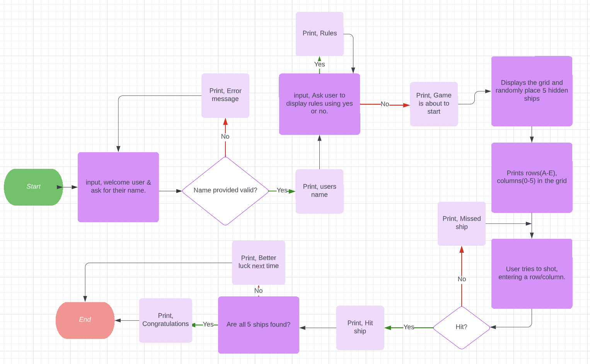
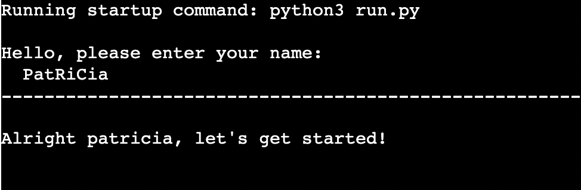
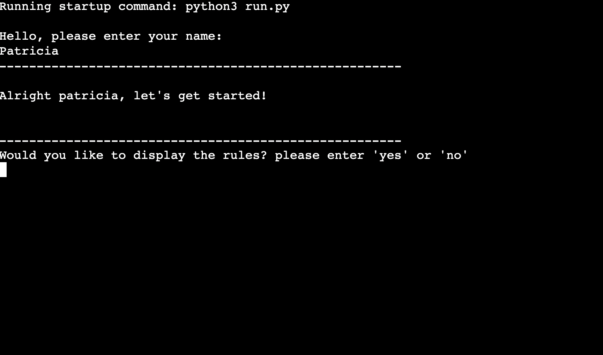
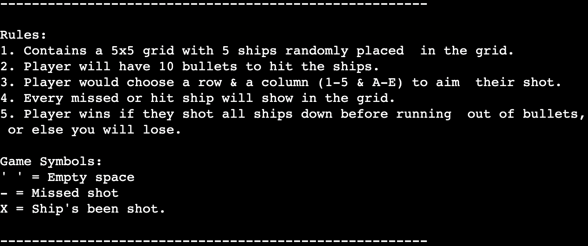
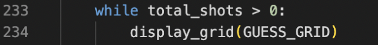
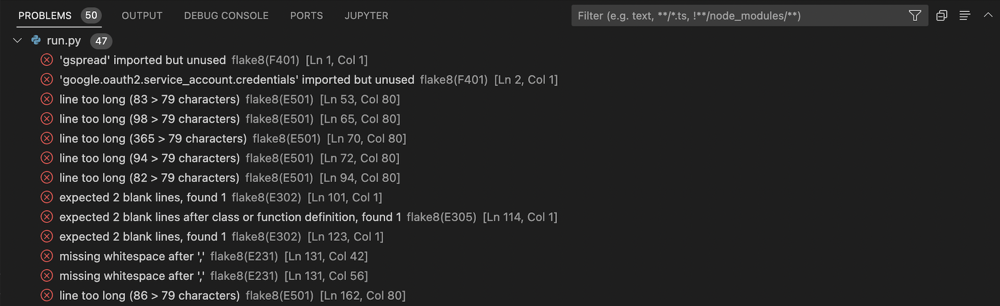

# -------------------------- BATTLESHIP ---------------------------

### [Play the game here!](https://project-3.herokuapp.com/)

## Description

How to play:
1. Battleship contains a 5x5 grid with 5 hidden ships randomly placed in the grid.
2. Player will have 10 bullets to hit the ships.
3. Player must choose a row & a column (1-5 & A-E) to aim their shot.
4. Every missed or hit ship will show in the grid.
5. Player wins if they shoot all 5 ships down before running out of bullets,
   or else they will lose.

Game Symbols:
1. " " = Empty space
2. O   = Missed shot
3. X   = Ship's been shot.

## Index - Table of contents

* [Description](#description)
* [Index - Table of contents](#index-table-of-contents)
* [User Experience](#user-experience)
* [Structure](structure)
* [Features](#excisting-features)
* [Design](#design)
* [Technologies used](#technological-used)
* [Tools Used](#tools)
* [Tests](#testing)
* [Deployment](#deployment)
* [Credits](#credits)

## User Experience
A.First Time Visitor Goals
a. As a first time visitor, I want to quick and easily understand the game's purpose.
b. As a first time visitor, I want the website to be readable and clear to follow the instructions.

B.Returning Visitor Goals
a. As a returning visitor, I want to easily navigate through the rules to find out how this game works.

## Structure
The game has a series of steps to easily follow. I tried to make the instructions clear for viewer to understand. Every decision made will have a path to follow, it can either be positiv or negative.

Following a youtube video to understand the game structure, what functions I might need to create this game. Then trying to put togheter this Lucid chart, the programming changed a little bit as I bumped into some errors along the way.

## Excisting Features

## f1 Intro
    Created an input to welcome user and ask them kindly to enter their name.
    I used strip() & lower() to remove any extra spacing in the start or -& at the end of the input.

## f2 Options
    Created an input to display 2 options, either play the game or to display the rules.
    User will enter "yes" or "no".
    With a little reminder from my mentor Brian I used strip() & lower() to remove any extra spacing
    the start or -& at the end of the input and to take lowercase letters.

## Design

* Intro, options:
  Using multible print statements to make the site more readable.
  I used prints to print out a line over and under the messages I wanted user to read and added some prints to print an empty line, this would cause some space where the message pops up.
  
  Example,
  

## Technological used

Language used,
  Python 3.8.11

## Tools
[Github](https://github.com/): Used to create a repository.

[Heroku](https://dashboard.heroku.com/apps): Used to deploy the website so code can run properly.

[LucidChart](https://www.lucidchart.com/pages/sv/landing?utm_source=google&utm_medium=cpc&utm_campaign=_chart_sv_allcountries_mixed_search_brand_exact_&km_CPC_CampaignId=1705450947&km_CPC_AdGroupID=69165079880&km_CPC_Keyword=lucidchart&km_CPC_MatchType=e&km_CPC_ExtensionID=&km_CPC_Network=g&km_CPC_AdPosition=&km_CPC_Creative=331143569437&km_CPC_TargetID=kwd-33511936169&km_CPC_Country=1012321&km_CPC_Device=c&km_CPC_placement=&km_CPC_target=&gclid=Cj0KCQiA1ZGcBhCoARIsAGQ0kkrCqHJ1rbIdiqCkK59HFE5tQLBnFSFpXja6klJJ72aby86dD_hWI4waAuJLEALw_wcB): Used to create the flowchart for the game.

## Testing

## Problems along the programming:
### f1 Functions order
    Problem,
    I couldn't figure out how to display the intro and options before the actuall game started. After being stuck on this part for way to long i tried:
    Changing the order of the functions, it didn't work.
    Calling them in different order in main() function, it didn't work.
    I tried to def a function for this (didn't work).

    Solution,
    Eventually I gave up and my mentor Brian helped me understand, I had to put "row, column = get_player_shot()" in the new function for it to work.

    Example below, before putting it in a function called "run_game()".

### f2 Input valid?
    Problem,
    When user typed in their name they couldn't write their name with big letters. I couldn't figure out how to fix this, I knew it was an easy fix. After trying all types of combinations and googling on slack I still didn't find the easy solution I needed.

    Solution,
    Eventually I found the solution in an old message between me and my mentor. I could just use the different methods in order: strip().lower().

### f3 Line too long
    Problem,
    I had a lot of errors in my code, proved to be mostly docstrings and 2 prints too long.

    Solution,
    Docstrings were cut and moved to a new line. I did the same with print("Message in here"), that proved to destroy my code I wrote so i googled and found the solution [here](https://www.interviewqs.com/ddi-code-snippets/break-long-line-python).
    I broke down the print("Message in here") like this: print("Message", "in here"), and moved it to a new line after the ",".

### f4 Fixing problems in gitpod
    Problem,
    "Expected 2 blank lines, found 1"
    "Missing whitespace after ','"
    I fixed this and removed most of my problems, then when I run the code, functions appeared in wrong order in the terminal. After trying for some time to understand why my code didn't work with gitpods guidlines I decided to keep the original code(no whitespace after ',')

    Solution,
    "Expected 2 blank lines, found 1" I googled a little bit on StackOverFlow and learned that after a function there should be 2 blank lines (link under credits).

    Example below of what the problems looked like before fixing them

## Deployment

* These are the steps to clone in GitHub:
  * Log in to GitHub and go to [repositories](https://github.com/Pisen99/project-3.ci).
  * In GitHub on the right side of the repository click on the green button "<> code".
  * Click the http and copy the link.
  * Open terminal gitbash and change current working directory to where you want the cloned directory to be.
  * Write "git clone", then paste the link that you copied before, press enter to start a cloning process.
* These are the steps to deploy in Heroku:
  * Log in to [Heroku](https://dashboard.heroku.com/apps)
  * In the right corner press the white button with purple text "New" and press "create new app".
  * Select region and type in a name that is avalable, then press the purple button "create app".
  * Go to settings and select Config Vars, there you enter KEY: PORT VALUE: 8000
  * Go back to deploy and on the left side, a little down on the page "Deployment method
"  connect to GitHub.
  * Type in your repository name, search and then press connect.
  * This might take a few minutes to create, once it's done click visit and your code will appear in a new tab.

## Credits

Used template from code institute's Walk through project ["Love-Sandwiches"](https://github.com/Code-Institute-Org/python-essentials-template)

Game structure comes from this [video](https://www.youtube.com/watch?v=tF1WRCrd_HQ)

Used as an inspiration for making rules appear for user and help to write deployement in readme: [Iama3191](https://github.com/iama3191/hangman)

Used to understand what problem ["Expected 2 blank lines, found 1"](https://stackoverflow.com/questions/40275866/pycharm-shows-pep8-expected-2-blank-lines-found-1)

I would also like to credit Code Institutes tutors that helped me, thank you Jason & Ed.
I would also like to my mentor from Code Institute that helped me understand Python, how to structure, how to start some codes and understand some errors that occured along the way.